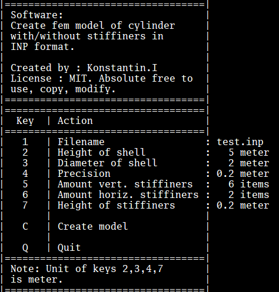
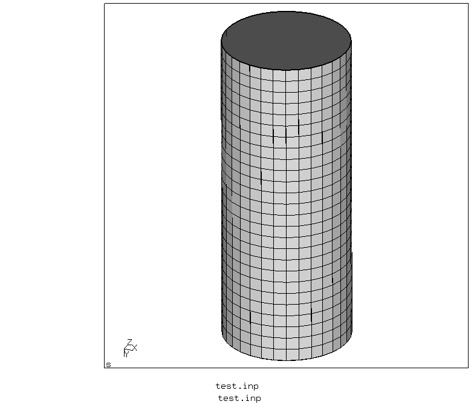

# Shell Generator

Generate shell mesh with external stiffiners

Stiffiner is plate on cylinder

Input data:
  * Diameter of cylinder
  * Height cylinder
  * Stiffiners(Height and amount):
  	* Vertical
	* Horizontal
  * Distance between points
  * Type of finite element : 3-node, 4-node, 6-node, 8-node finite element
  * **TODO** : different type of vertical and horizontal stiffiners
  * **TODO** : Different height of stiffiners
  * **TODO** : I-column
  * **TODO** : Imperfection - Oval, Defect
  * **TODO** : GMSH creating model

Result:
  * INP mesh


Console menu




Cylinder


```golang
	filename := "exampleCylinder.inp"
	// remove file //
	_ = os.Remove(filename)
	// input data //
	s := shellGenerator.Shell{Height: 5.0, Diameter: 2.0, Precision: 0.2}
	// write the result to INP format //
	err := s.GenerateINP(filename)
	if err != nil {
		fmt.Printf("Wrong mesh: %v\n", err)
		return
	}
```


Cylinder with stiffiners


```golang
	filename := "demoCylinderWithStiffiners.inp"
	// remove file //
	_ = os.Remove(filename)
	// input data //
	var shellStiff ShellWithStiffiners
	if err := shellStiff.AddShell(Shell{Height: 5, Diameter: 2.0, Precision: 0.2}); err != nil {
		fmt.Printf("Wrong shell: %v\n", err)
		return
	}
	if err := shellStiff.AddStiffiners(2, 6, 0.2, 0.5); err != nil {
		fmt.Printf("Wrong stiffiner: %v\n", err)
		return
	}
	// write the result to INP format //
	err := shellStiff.GenerateINP(filename)
	if err != nil {
		fmt.Printf("Wrong mesh: %v\n", err)
		return
	}
```
